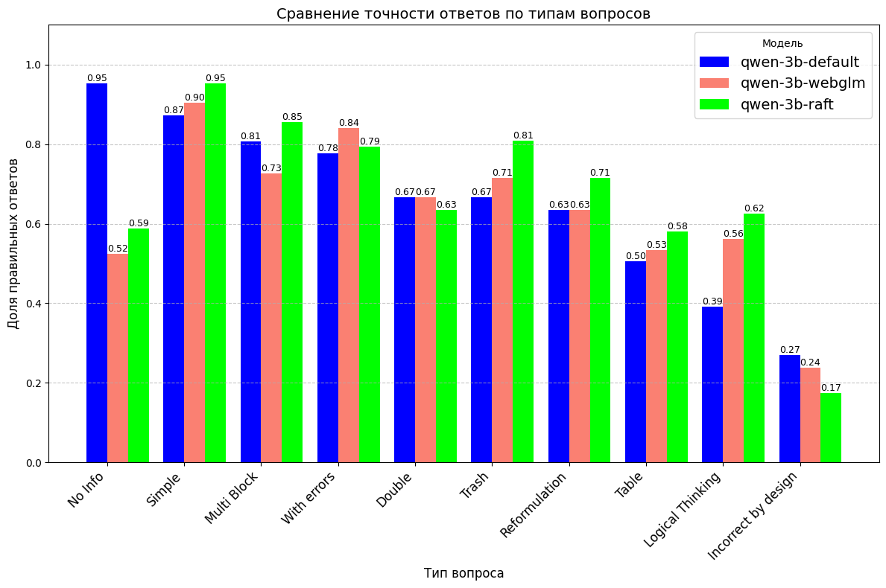

# Бакалаврская выпускная работа

## **Построен RAG pipeline**

 - Предобработку pdf документов через библиотеку [Docling](https://github.com/docling-project/docling).
  
 - Формирование поисковых индексов через библиотеку FAISS.

 - Модель эмбеддер [e5-large](https://huggingface.co/intfloat/multilingual-e5-large).

 - Генеративные модели [Qwen2.5-1.5B-Instruct](https://huggingface.co/Qwen/Qwen2.5-1.5B-Instruct) и [Qwen2.5-3B-Instruct](https://huggingface.co/Qwen/Qwen2.5-3B-Instruct).
    

## **Собран RAG бенчмарк**

Содержащий следующие домены:

- Научные статьи и регламенты
- Техническая документация
- Финансовые и аналитические отчёты

И следующую типизацию вопросов:

1. Simple  
2. With errors  
3. Trash  
4. Reformulation  
5. Incorrect by design  
6. Table  
7. No Info  
8. Double  
9. Multi Block  
10. Logical Thinking  

Общий размер - 674 примера. 

## **Исследована адаптация модели к контекстной генерации**

Проведены эксперименты с различными этапами дообучения генеративной модели:

- Предварительная русификация на датасете [Saiga](https://huggingface.co/datasets/IlyaGusev/saiga_scored).
- Дообучение на переведенный датасет [WebGLM-QA](https://huggingface.co/datasets/THUDM/webglm-qa).
- Метод [Retrieval Augmented FineTuning](https://arxiv.org/abs/2403.10131).
- Дообучение на [синтетических словарях](https://arxiv.org/abs/2406.19292).

Всё дообучение проводилось для 1.5B и 3B моделей через LoRA адаптеры. 

Ключевые результаты: 

 

| 
Model
 | 
AVG Score
 | 
Accuracy
 | 
Irrelevant Refuse
 |
|:---:|:---:|:---:|:---:| 
| Qwen2.5-1.5b-default | 3.31 | 0.50 | 0.18 |
| Qwen2.5-1.5b-WebGLM | **3.37** | **0.53** | **0.06** |
| Qwen2.5-1.5b-RAFT | 3.32 | 0.50 | 0.15 |
| Qwen2.5-3b-default | 3.86 | 0.64 | 0.21 |
| Qwen2.5-3b-WebGLM | 3.73 | 0.63 | 0.05 |
| Qwen2.5-3b-RAFT | **3.86** | **0.67** | **0.03** |
| Qwen2.5-32b-default | 4.28 | 0.77 | 0.12 |  

## **Исследована актуальность проблемы Lost in the Middle в сценариях работы RAG систем**

| 
Documents
 | 
Default order
 | 
Reverse order
 | 
Random
 |
|:---:|:---:|:---:|:---:| 
| Top-5 (2k context) | **0.68** | 0.64 | 0.68 |
| Top-10 (4k context) | **0.72** | 0.71 | 0.68 |
| Top-20 (8k context) | 0.68 | 0.68 | **0.71** |